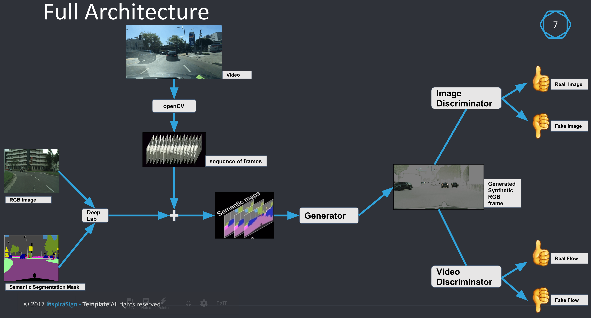

# Automated Turk: Enhancing Autonomous Vehicles.

## Why I have selected this problem?
Statistically, each year up to 1.2 million deaths occur due to car accidents across the globe are caused by human errors. Autonomous vehicle technology could drastically avoid these accidents. Self-driving car companies are constantly trying to make their autonomous vehicles more robust by capturing a wide distribution of all possible driving scenarios but have failed to achieve at this point due to past recurring crashes. These autonomous systems actually learn from driving videos and the problem with currently available video datasets are
  1. Not annotated.
  2. Most of them aren't high-resolution videos which is again an impediment for object detection.

## What I am offering?   
An AI software solution with help of which you can:
1. Generate Semantic Segmentation Masks for existing videos.
<p float="left">
  
   
</p>
2. Generate photo-realistic, high-resolution new driving videos.
 <br />

## How my Full Architechure looks like? 
It mainly constitutes of 3 components:
1. Video to frame sequence generator using OpenCV.
2. Generation of Semantic Segmentation masked frames for each associated frame sequences using [DEEPLAB](https://arxiv.org/abs/1606.00915) model. 
3. Generating new photo-realistic, high-resolution videos from the sequence of Semantic Segmentation masked frames using [conditional Generative Networks framework](https://arxiv.org/abs/1808.06601).

The full architecture: (Starting from LEFT to RIGHT.)
 <br />

##### Brief description of the main directory structure.
| Folder/Files       | Description           |
| :------------- |:-------------| 
| **src**      | Contains the main components of the architecture.
| **src/data_prepration**     | Scripts for cutting videos into frames using openCV.       |
| **src/semantic_seg_gen**  | Generates semantic segmentation masked frames.      |
| **src/synthetic_video_gen** | Generates new synthetic RGB frames.      |
| **results** | stiched frames in form of gifs      |
| **docker** | Dockerfile to run the complete project as standalone application in a container(work in progress)      |
| **datasets** |  Samples of BDD & Citycapes datasets used in the project.      |
| **utility** | python implementation of useful decorators. (assist development)      |
| **README.md** | Overview of the project & guide to use this codebase.       |

### Diving into codebase:

##### Pre-Requisites:
I have used AWS cloud sources for implementation, training/testing/validation of models. The [Deep Learning AMI (Ubuntu)](https://aws.amazon.com/marketplace/pp/B077GCH38C) has provided stable pre-intalled conda environments for `TensorFlow 1.10.0` & `PyTorch 0.4.1` with `CUDA 9.0`. First time users of AWS could use [this](https://docs.google.com/document/d/1v1SKwaa_nuFD2cpKmDFUHf66YQTTEpv80aus3g4yFP4/edit?ts=5b96f8e6) to setup there environment.

The p2.xlarge instance was used for second component & p3.2xlarge instance for third component as described below.

| EC2-instance size        | GPUs        | GPU Memory (GB)  |
| ------------- |:-------------| :-----|
| [p2.xlarge](https://aws.amazon.com/ec2/instance-types/p2/)      | 1 (NVIDIA K80) | -- |
| [p3.2xlarge](https://aws.amazon.com/ec2/instance-types/p3/)      | 1 (NVIDIA Tesla V100)      |   16 |

I have also used S3 bucket for data dumps using a [python script](src/data_prepration/data_BDD100K2S3.py). You could also leverage [my hacks](https://gist.github.com/anubhav0fnu/3d4f6a3c9ce1342fb1d3671613150b65) & different IDE integration options [here](https://stackoverflow.com/questions/52340973/is-it-possible-to-ssh-in-aws-instances-using-any-ides-such-pycharm/52378438#52378438) to quickly get started working on cloud sources on a local workstation.

##### Setting it up!
Once you have setup your AWS AMI for an EC2 instance, ssh into the machine, and follow the below instructions:

**Installation**:

Switch to tensorflow_p36 conda environment & install : 
> **Component 1**:
opencv
pillow
```python
pip install opencv-python
pip install Pillow==2.2.1
```

> **Component 2**:
tf Slim ( It picks up the binaries from tensorflow installation!)

jupyter notebook (Needed for quick visualization.)

```python
conda install -c anaconda jupyter
```

Now, switch to pytorch_p36 conda environment & install : 
> **Component 3**:

[dominate](https://github.com/Knio/dominate) 
```python
pip install dominate requests
```
Download and compile a snapshot of FlowNet2 by running:

```python
python src/synthetic_video_gen/scripts/download_flownet2.py
```

**NOTE**: Very soon, I will be providing a dockerfile that which will take care of you environment & repository setup in a docker container as explained above.

### Component 1: Data prepration.
`src/data_prepration/data_prep.py`

This script uses `OpenCV` to cut videos in to frames and save it into the desired folder. 

### Component 2: Semantic Segmentation mask generation.

The below directory structure is needed for `src/semantic_seg_gen` because it contains deeplab code & datasets in TFrecord format. For this component, I have used a well documented pre-existing implementation of [deeplab](https://github.com/tensorflow/models/tree/master/research/deeplab). 

As, GitHub doesn't support large files, I have written extra instructions while describing the directory structure. Datasets, models, & frozen graphs could be downloaded using [this script](src/semantic_seg_gen/download_data_in_dir.sh). 

---
```bash
semantic_seg_gen
├── bdd100k (dataset-1)
│   ├── bdd100kscripts
│   ├── checkpoints
│   ├── exp (create these directories, required by deeplab scripts.)
│   │   └── train_on_train_set
│   │       ├── test
│   │       ├── train
│   │       └── val
│   ├── images
│   ├── labels
│   └── tfrecord
├── build_cityscapes_data.py (find scripts at "https://github.com/tensorflow/models/tree/master/research/deeplab/datasets/")
├── build_data.py
├── cityscapes (dataset-2)
│   ├── checkpoints
│   │   └── deeplabv3_cityscapes_train
│   ├── cityscapesscripts (maintain hierarchy, git clone "https://github.com/mcordts/cityscapesscripts.git")
│   │   ├── annotation
│   │   ├── evaluation
│   │   ├── helpers
│   │   ├── preparation
│   │   └── viewer
│   ├── exp
│   │   └── train_on_train_set
│   │       ├── eval
│   │       ├── train
│   │       └── vis
│   │           ├── raw_segmentation_results
│   │           └── segmentation_results
│   ├── gtfine (login & download the "gtfine_trainvaltest.zip" dataset)
│   │   ├── test
│   │   ├── train
│   │   └── val
│   ├── leftimg8bit (login & download the "leftimg8bit_trainvaltest.zip" dataset)
│   │   ├── test
│   │   ├── train
│   │   └── val
│   └── tfrecord (filled by "convert_cityscapes.sh" script.)
├── convert_cityscapes.sh (split data into train & val sets & converts totfrecords's shards.)
├── deeplab ( git clone https://github.com/tensorflow/models/blob/master/research/deeplab)
│   └── ...
├── deeplab_train_1.sh (script to run deeplab/train.py)
├── deeplab_eval_1.sh   (script to run deeplab/eval.py)
├── deeplab_vis_1.sh   (script to run deeplab/vis.py)
└── download_data_in_dir.sh (after creating above directory structure, could be used for populating directories.)
```
---

The deeplab implementation is in tensorflow, and we need to first convert our dataset into TFrecord. You can use [this script](src/semantic_seg_gen/convert_cityscapes.sh) for this purpose. Once you have your dataset in a proper format, start with training and evaluation.

The second froze checkpoint was used for evaluation and comparing results among other 3 will be posted soon [here.]() 

---
| Number| checkpoint name | pre-trained dataset  |
| :------------- | :------------- |:-------------|
|1 | deeplab_cityscapes_xception71_trainfine    | ImageNet+ MS-COCO + {Cityscapes train_fine set} |
|2 | deeplabv3_cityscapes_train    | ImageNet+ {Cityscapes train_fine set}      |      
|3 | deeplab_cityscapes_xception71_trainvalfine     | ImageNet+ MS-COCO+ {Cityscapes trainval_fine and coarse set}

---


**Training**:

`src/semantic_seg_gen/deepLab_train_1.sh`

It is the local training job using `xception_65` model. I have highlighted some of the problems I have faced during training in the comments within the script.


**Evaluation**:

Later, using the latest checkpoint collected in `src/semantic_seg_gen/cityscapes/exp/train_on_train_set/train/train_00_result` directory, we could generate the semantic masks for our sequence of images.


### Component 3: Video Synthesis using Conditional GAN.
Once we have our `labels` a.k.a `Semantic Segmentation Masks (SSM)` available for our videos(sequence of frames). We can start with 

**Training**:

For single GPU, use

`src/synthetic_video_gen/scripts/street/test_g1_1024.sh`

For multiple GPUs use

`src/synthetic_video_gen/scripts/street/train_2048.sh`

**Testing**: 

For single GPU, use

`src/synthetic_video_gen/scripts/street/test_g1_1024.sh`

For multiple GPUs use

`src/synthetic_video_gen/scripts/street/test_2048.sh`

The below are results on two scales. In each category the initial results are based on 3 inputs to the sequential generator : `current (SSM)`, `previous 2 SSMs`, `previous 2 generated synthetic frames.` and later results are based on an additional 4th input to the generator which is the foreground feature of the input SSM's. 

#### Medium(scale: 1024) trained Generator model.
##### Before

 <br />

##### After

 <br />

#### Fine (scale: 2048) trained Generator model.

##### Before

 <br />

##### After

 <br />

